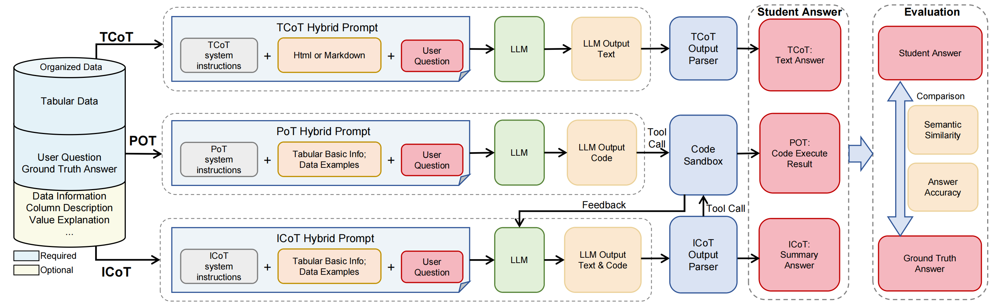

# TReB
<div align="left" style="line-height: 1;">
  <a href="" style="margin: 2px;">
    
  </a>
  <a href="" style="margin: 2px;">
    
  </a>
</div>
Official repository for paper "TReB: A Comprehensive Benchmark for Evaluating Table Reasoning Capabilities of Large Language Models"

<p align="left">
    <a href="https://github.com/JT-LM/jiutian-treb">🏠 Github Page </a> •
    <a href="https://modelscope.cn/datasets/JiuTian-AI/JIUTIAN-TReB">🤗 Benchmark Data </a> •
    <a href="http://arxiv.org/abs/2506.18421">🧾 Paper </a>
</p>

## 🧾 Overview
  <p>
    <code><b>TReB</b></code> is a <b>reliable</b> and <b>comprehensive</b> benchmark that offers assessment of 
    LLM capabilities for table reasoning. It covers:
  </p>
  <ul>
    <li>
      A <b>comprehensive dataset</b> combining cleaned public benchmarks, real-world web tables, and proprietary data, 
      covering <b>six core capabilities</b> and <b>26 tasks</b> to support diverse table reasoning evaluations.
    </li>
    <li>
      A <b>robust framework</b> specifically designed to evaluate LLM performance on table reasoning tasks. It integrates 
      diverse inference modes (<b>TCoT</b>, <b>PoT</b>, and <b>ICoT</b>) and reliable metrics, enabling precise and 
      multi-dimensional evaluations.
    </li>
  </ul>

<p align="center">

</p>

## 📚 Benchmark Introduction

### Dataset
The <a href="https://modelscope.cn/datasets/JiuTian-AI/JIUTIAN-TReB">🤗 Dataset</a> spans the complete capability spectrum from fundamental language understanding to advanced data analysis, encompassing six core skills with 26 subtasks. 

| **Skill**                                   | **Description**                                                                                                                                                                                                                                                       |
|---------------------------------------------|-----------------------------------------------------------------------------------------------------------------------------------------------------------------------------------------------------------------------------------------------------------------------|
| **Natural Language Understanding** | Measures LLMs' performance in fundamental NLP capabilities, such as understanding, instruction following, and code generation. Evaluates linguistic command parsing, instruction execution, text generation reliability, and logical consistency.                      |
| **Table Understanding**          | Focuses on parsing structures and comprehending content in tabular data. Evaluates table structure identification, key information retrieval, summary accuracy, and logical reasoning based on tabular facts.                                                            |
| **Table Basic Operation**           | Evaluates the ability to convert natural language intents into executable instructions for basic structured data operations. Covers query comprehension, field localization, and condition parsing.                                                                      |
| **Table Computational Operation**        | Focuses on performing complex computational tasks in structured data scenarios. Evaluates mathematical expression comprehension, function selection, domain-specific computation, and complex relationship parsing.                                                     |
| **Data Analysis**                    | Measures basic statistical analysis and pattern recognition in structured data. Evaluates statistical metric calculation, variable relationship modeling, and result interpretation, reflecting data insight capabilities.                                               |
| **Advanced Data Analysis**           | Handles high-complexity, multi-step (≥3 steps) data analysis tasks. Evaluates multi-stage information fusion, logical path planning, and cross-task reasoning, enabling structured data-driven complex problem solving and decision support.                             |               |

### Evaluation framework

#### Inference modes

| **Mode**                                   | **Description**                                                                                                                                                                                                                                                       |
|---------------------------------------------|-----------------------------------------------------------------------------------------------------------------------------------------------------------------------------------------------------------------------------------------------------------------------|
| **Textual Chain-of-Thought (TCoT)** | TCoT is a reasoning mode in which LLMs solve data analysis problems step by step through pure textual reasoning. The final answer is output exclusively in text form.                      |
| **Program-of-Thought (PoT)**          | PoT is a reasoning mode in which LLMs solve data analysis problems by generating executable code. In this mode, the model combines textual reasoning with programmatic outputs and ultimately producing a code block as its final answer.                                                            |
| **Interleaved Chain-of-Thought (ICoT)**           | The ICoT mode enables models to perform multi-step reasoning by combining textual explanations and programmatic outputs in an iterative process. This advanced mode integrates planning, step-by-step execution, and self-reflection, allowing the model to dynamically adapt its reasoning based on intermediate results.                                                                      |


#### Evaluation metrics

| **Metric**                                   | **Description**                                                                                                                                                                                                                                                       |
|---------------------------------------------|-----------------------------------------------------------------------------------------------------------------------------------------------------------------------------------------------------------------------------------------------------------------------|
| **Natural Language Metrics** | Natural language metrics including BLEU and ROUGE-L.                      |
| **LLM-as-a-Judge**          | A discriminant LLM is used to assess semantic similarity and correctness of answers against ground truth                                                            |
| **Exact Match Accuracy**           | Accuracy is utilized for tasks where LLMs are required to generate outputs in a predefined format, enabling direct and unambiguous comparison with ground truth.   

## 🔧 How to evaluate LLMs on TReB

### Step 1. Download the dataset

Download the latest version of <a href="https://modelscope.cn/datasets/JiuTian-AI/JIUTIAN-TReB">🤗 Dataset</a> from Hugging Face and place it in your working directory.

### Step 2. Write your config file

Write your JSON config file for evaluation.

Example JSON structure:
```python
config_json = {
    "version": "default", # Inference version, affects result path
    "round": 1, # Inference round
    "model_config": {
        "reason_model_name": "{your model name}", # Reasoning model name, e.g., QwQ-32B
        "reason_model_path": "{your model path}", # Path to reasoning model
        "reason_model_cards": "0,1,2,3,4,5,6,7", # GPUs for reasoning model
        "reason_max_model_len": 8192, # Context length for reasoning model
        "reason_temperature": 0.2, # Temperature for reasoning model
        "judge_model_name": "{your judge model name}", # Judge model name
        "judge_model_path": "{your judge model path}", # Path to judge model
        "judge_model_cards": "0,1,2,3,4,5,6,7", # GPUs for judge model
        "judge_max_model_len": 10240 # Context length for judge model
    },
    "dataset_config": {
        "Table_Retrieval": { # Dataset name
            "path": "{your data path}/Table_Retrieval.json", # Dataset path
            "reason_mode": [ # Inference modes (multiple options)
                "TCoT_md", # TCoT mode, Tables in markdown format
                "TCoT_html", # TCoT mode, Tables in HTML format
                "PoT", # PoT mode
                "ICoT" # ICoT mode
            ],
            "if_instruction": false, # Include instructions in prompt
            "if_title": true, # Include table title in prompt
            "metrics": [ # Evaluation metrics (multiple options)
                "BLEU", # BLEU score
                "ROUGE", # ROUGE-L score
                "EM", # Exact Match
                "LLM_score" # LLM-as-a-judge score
            ]
        },
        ...
    }
}
```
We provide an example config file at: `config/config_example.json`

### Step 3. Run evaluation with Your LLM
The following two steps need to be run to get the evaluation results:
1. **Execute model inference**:
   ```bash
   cd src
   python -u run_eval.py --config "your-config-file.json" --run_step "reason"
   ```

2. **Execute answer evaluation**:
   ```bash
   cd src
   python -u run_eval.py --config "your-config-file.json" --run_step "judge"
   ```

### Step 4. Check the Results
All results are saved in the jsonl file at the following path: 
```
eval_output/{config_json['version']}/{config_json['model_config']['reason_model_name']}/{inference mode}--{dataset name}--round{config_json['round']}--judge.jsonl
```
For example, if your config file is the same as the contents of Step2, the evaluation results of the dataset `Table_Retrieval` in `PoT` mode are saved in the following path:
```
eval_output/default/{your model name}/PoT--Table_Retrieval--round1--judge.jsonl
```
Read the jsonl file by rows, each row being a json that stores all the information for a single sample. the scores field is `judge_scores`.

Example JSON structure:

```python
{
  # The following fields correspond to the fields in the dataset.
  "id": "dataset_name|example_id",
  "file_path": ["path/example.csv"],
  "instruction": "example_instruction",
  "question":"example_question",
  "answer":"example_answer",
  "title":["example_title"],
  "columnslable": [1],
  "Table_markdown":["example_markdown"],
  "Table_html":["example_html"],
  "number_answer": "str or float",

  # The following are fields related to model inference.
  "mode":"PoT", # infer mode
  "df":"dataframe str",
  "input_prompt":"example prompt", # question prompt
  "history":"example history", # full history
  "generation":"example generation", # model response
  "text_result":"text answer", # parsed TCoT or ICoT answer
  "code":"the last code", # parsed last code
  "code_run_result":"code run result", # parsed PoT answer

  # The following are fields related to evaluation scores.
  "judge_scores":
    {
      "BLEU": 0.0, # BLEU score
      "ROUGE": 0.0, # ROUGE-L score (range is [0, 1])
      "EM": 0.0, # exact match score
      "LLM_score": 0, # LLM-as-a-judge score (range is [0, 10])
      "LLM_score_reason": "\\boxed{0}" # LLM-as-a-judge reponse
    },
}
```

## Note
Some details to note:
- The Python package versions mentioned in `requirements.txt` are not strictly fixed. Users can modify these versions appropriately based on their own environment.
- When testing `Natural Language Understanding` tasks, the output may display `{data_id}: no table content!`. This is a normal output since the tasks do not involve input tables.
- During the `judge` phase, the output may include `INFO rouge_scorer.py:83: Using default tokenizer`. This is also a normal output.
- For security reasons, we only allow the program to access files in specific directories (including config, eval_log, and eval_output). If needed, you can modify the `is_safe_path` function in `file_op.py`.
- The code executor in this project has only undergone basic security rule configuration, which cannot prevent the generation of unsafe code by the model. Therefore, this project is not recommended for direct use in production environments. Disclaimer: This project is intended for academic research purposes only. Any security issues caused by improper use are not the responsibility of this project.

## Liscence

`TReB` is distributed under the terms of the [Apache 2.0](https://spdx.org/licenses/Apache-2.0.html) license.

## Citation
If you find our work helpful, please use the following citations.
```bibtext
@misc{li2025trebcomprehensivebenchmarkevaluating,
      title={TReB: A Comprehensive Benchmark for Evaluating Table Reasoning Capabilities of Large Language Models}, 
      author={Ce Li and Xiaofan Liu and Zhiyan Song and Ce Chi and Chen Zhao and Jingjing Yang and Zhendong Wang and Kexin Yang and Boshen Shi and Xing Wang and Chao Deng and Junlan Feng},
      year={2025},
      eprint={2506.18421},
      archivePrefix={arXiv},
      primaryClass={cs.CL},
      url={https://arxiv.org/abs/2506.18421}, 
}
```
